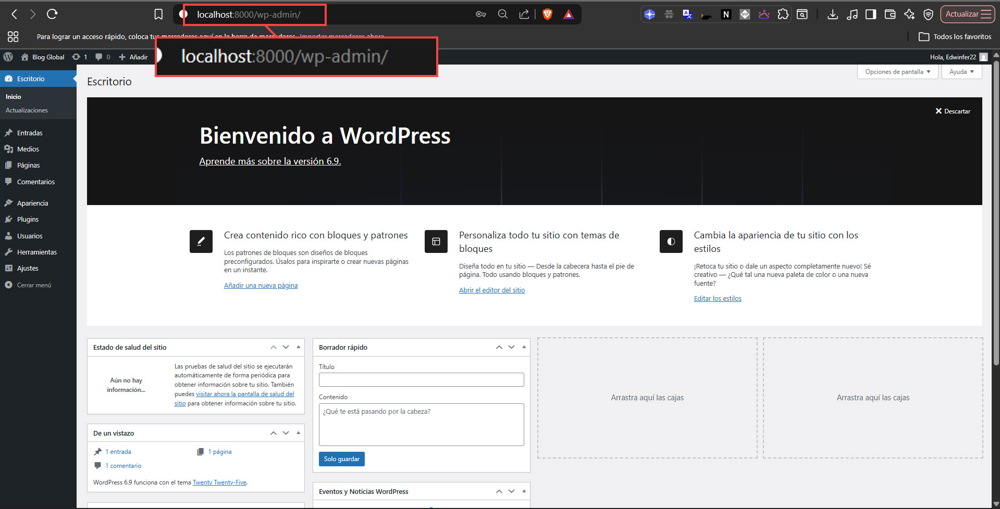

# WordPress Docker Project

This project runs a WordPress site using Docker and Docker Compose. It includes a WordPress service and a MySQL database service.

## Prerequisites

- Docker
- Docker Compose

## Paso a Paso

1.  **Clonar el Repositorio:**
    Obtén una copia del proyecto en tu máquina local.
    ```sh
    git clone https://github.com/edwinfer22/wordpress-docker-project.git
    cd wordpress-docker-project
    ```

2.  **Iniciar los Servicios:**
    Usa Docker Compose para levantar los contenedores en segundo plano.
    ```sh
    docker-compose up -d
    ```

3.  **Instalación de WordPress:**
    Abre tu navegador y ve a `http://localhost:8000`. Verás la página de instalación de WordPress. Sigue las instrucciones para configurar el título del sitio, tu usuario y contraseña.

    

4.  **¡Listo!**
    Tu sitio de WordPress está funcionando.

## Accessing the Site

Once the containers are running, you can access the WordPress installation by navigating to the following URL in your web browser:

[http://localhost:8000](http://localhost:8000)

## Stopping the Services

To stop all the running services, use the command:

```sh
docker-compose down
```

---

## Explicación de la Configuración de Docker

Este proyecto utiliza Docker para empaquetar la aplicación de WordPress y sus dependencias en contenedores aislados. Esto garantiza que el entorno de desarrollo sea consistente, portátil y no interfiera con otro software en tu máquina.

### El archivo `docker-compose.yml`

Este archivo es el plano de construcción de toda la aplicación. Define los servicios, redes y volúmenes necesarios.

*   **`services:`**: Cada servicio representa un contenedor.
    *   **`db` (Base de Datos)**:
        *   `image: mysql:8.0`: Utiliza la imagen oficial de MySQL 8.0 de Docker Hub. Esta imagen es un paquete que ya contiene un sistema operativo mínimo con MySQL listo para funcionar.
        *   `environment: [...]`: Configura el contenedor de MySQL, estableciendo las contraseñas y nombres de la base de datos en el arranque.
        *   `volumes: - db_data:/var/lib/mysql`: Crea un **volumen** llamado `db_data`. Esto conecta el almacenamiento persistente de la máquina anfitriona con la carpeta de datos dentro del contenedor. Garantiza que los datos de tu blog no se pierdan al detener o eliminar los contenedores.
    *   **`wordpress` (Aplicación)**:
        *   `image: wordpress:latest`: Usa la imagen oficial de WordPress, que incluye WordPress, un servidor web Apache y PHP.
        *   `ports: - "8000:80"`: Redirige el puerto 8000 de tu máquina al puerto 80 del contenedor, permitiéndote acceder al sitio a través de `http://localhost:8000`.
        *   `depends_on: - db`: Asegura que el contenedor de WordPress no se inicie hasta que la base de datos (`db`) esté lista.

### Comandos de Orquestación

*   **`docker-compose up -d`**: Lee el archivo `docker-compose.yml` y ejecuta todo el plano: descarga imágenes, crea redes y volúmenes, e inicia los contenedores en el orden correcto y en segundo plano (`-d`).
*   **`docker-compose down`**: Detiene y elimina los contenedores y redes creados por `up`. Por defecto, no elimina los volúmenes para proteger tus datos.
